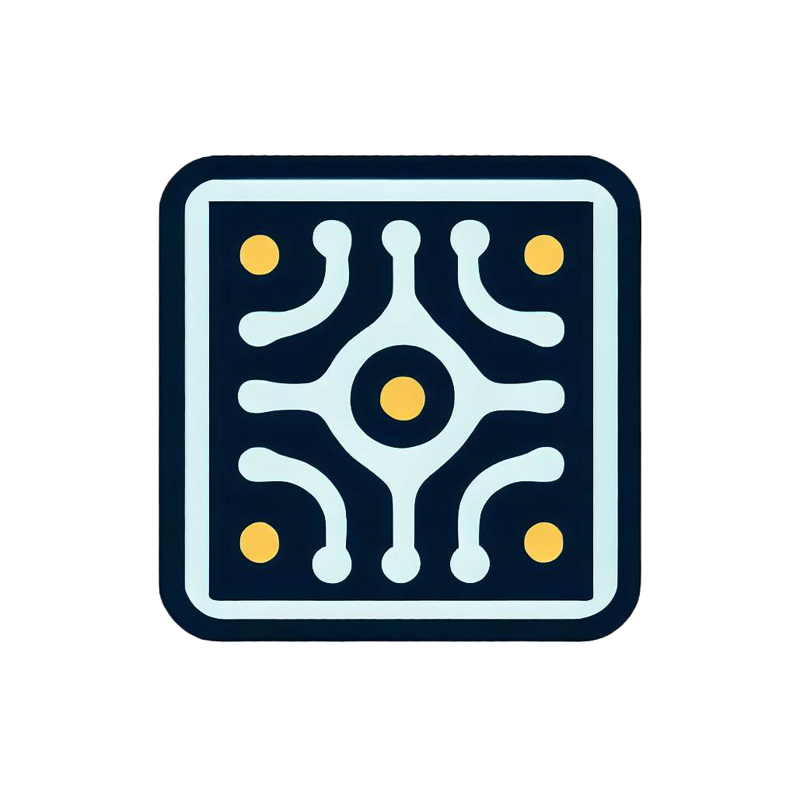

<!-- PROJECT LOGO -->
<br />
<div align="center">
  <a href="https://github.com/KeyArgo/ImageClassificationCNN">
    
  </a>

<h3 align="center">Convolutional Neural Network for CIFAR-10 dataset</h3>

  <p align="center">
    This code implements a Convolutional Neural Network (CNN) to classify images from the CIFAR-10 dataset. The CIFAR-10 dataset consists of 60,000 32x32 color images in 10 classes, with 6,000 images per class.
    <br />
    <a href="https://github.com/KeyArgo/ImageClassificationCNN"><strong>Explore the docs »</strong></a>
    <br />
    <br />
    <a href="https://github.com/KeyArgo/ImageClassificationCNN">View Demo</a>
    ·
    <a href="https://github.com/KeyArgo/ImageClassificationCNN/issues">Report Bug</a>
    ·
    <a href="https://github.com/KeyArgo/ImageClassificationCNN/issues">Request Feature</a>
  </p>
</div>


<!-- TABLE OF CONTENTS -->
<details>
  <summary>Table of Contents</summary>
  <ol>
    <li>
      <a href="#about-the-project">About The Project</a>
      <ul>
        <li><a href="#built-with">Built With</a></li>
      </ul>
    </li>
    <li>
      <a href="#getting-started">Getting Started</a>
      <ul>
        <li><a href="#dependencies">Dependencies</a></li>
        <li><a href="#training">Training</a></li>
      </ul>
    </li>
    <li><a href="#usage">Usage</a></li>
    <li><a href="#contributing">Contributing</a></li>
    <li><a href="#license">License</a></li>
    <li><a href="#contact">Contact</a></li>
  </ol>
</details>


<!-- ABOUT THE PROJECT -->
## About The Project

This repository contains a TensorFlow-based implementation of a Convolutional Neural Network (CNN) for image classification on the CIFAR-10 dataset.

<p align="right">(<a href="#readme-top">back to top</a>)</p>


### Built With

<p align="left">
  <a href="https://www.tensorflow.org" target="_blank" rel="noreferrer">
    
  </a>
</p>

<p align="left">
  <a href="https://keras.io/" target="_blank" rel="noreferrer">
    
  </a>
</p>


<p align="left">
  <a href="https://matplotlib.org/" target="_blank" rel="noreferrer">
    
  </a>
</p>


<p align="right">(<a href="#readme-top">back to top</a>)</p>


<!-- GETTING STARTED -->
## Getting Started

This is an example of how you may give instructions on setting up your project locally.
To get a local copy up and running follow these simple example steps.

### Dependencies

To run this code, you need to have the following packages installed:

- TensorFlow (2.x)
- Matplotlib

You can install these packages using pip:

```bash
pip install tensorflow matplotlib
```

### Dataset

The CIFAR-10 dataset consists of 60,000 32x32 color images in 10 classes, with 6,000 images per class. There are 50,000 training images and 10,000 test images.

### CNN Architecture

The CNN architecture is defined as follows:

- Two Conv2D layers (32 filters, 3x3 kernel, ReLU activation, and same padding) with Batch Normalization, followed by MaxPooling2D (2x2) and Dropout (0.25)
- Two Conv2D layers (64 filters, 3x3 kernel, ReLU activation, and same padding) with Batch Normalization, followed by MaxPooling2D (2x2) and Dropout (0.25)
- Flatten the output and pass it through a Dense layer (128 units, ReLU activation) with Batch Normalization and Dropout (0.5)
- Final Dense layer (10 units, Softmax activation) for classification

### Training

The model is compiled with the Adam optimizer, SparseCategoricalCrossentropy loss, and accuracy as a metric. It is trained for 50 epochs with the validation dataset being the test dataset.

### Evaluation

The model is evaluated on the test dataset, and the test accuracy is printed.

### Usage

To train and evaluate the model, simply run the provided code in a Python environment with the required dependencies installed:

```python
python cifar10_cnn.py
```

This will train the model and print the test accuracy upon completion.

### Contributing

1. Fork the Project
2. Create your Feature Branch (`git checkout -b feature/AmazingFeature`)
3. Commit your Changes (`git commit -m 'Add some AmazingFeature'`)
4. Push to the Branch (`git push origin feature/AmazingFeature`)
5. Open a Pull Request

### License

Distributed under the MIT License. See `LICENSE.txt` for more information.

### Contact

Daniel LaForce - danlaforce3@gmail.com

Project Link: [https://github.com/KeyArgo/ImageClassificationCNN](https://github.com/KeyArgo/ImageClassificationCNN)


<!-- MARKDOWN LINKS & IMAGES -->
<!-- https://www.markdownguide.org/basic-syntax/#reference-style-links -->
[contributors-shield]: https://img.shields.io/github/contributors/KeyArgo/ImageClassificationCNN.svg?style=for-the-badge
[contributors-url]: https://github.com/KeyArgo/ImageClassificationCNN/graphs/contributors
[forks-shield]: https://img.shields.io/github/forks/KeyArgo/ImageClassificationCNN.svg?style=for-the-badge
[forks-url]: https://github.com/KeyArgo/ImageClassificationCNN/network/members
[stars-shield]: https://img.shields.io/github/stars/KeyArgo/ImageClassificationCNN.svg?style=for-the-badge
[stars-url]: https://github.com/KeyArgo/ImageClassificationCNN/stargazers
[issues-shield]: https://img.shields.io/github/issues/KeyArgo/ImageClassificationCNN.svg?style=for-the-badge
[issues-url]: https://github.com/KeyArgo/ImageClassificationCNN/issues
[license-shield]: https://img.shields.io/github/license/KeyArgo/ImageClassificationCNN.svg?style=for-the-badge
[license-url]: https://github.com/KeyArgo/ImageClassificationCNN/blob/master/LICENSE.txt
[linkedin-shield]: https://img.shields.io/badge/-LinkedIn-black.svg?style=for-the-badge&logo=linkedin&colorB=555
[linkedin-url]: https://linkedin.com/in/danlaforce
[product-screenshot]: images/screenshot.png
[Next.js]: https://img.shields.io/badge/next.js-000000?style=for-the-badge&logo=nextdotjs&logoColor=white
[Next-url]: https://nextjs.org/
[React.js]: https://img.shields.io/badge/React-20232A?style=for-the-badge&logo=react&logoColor=61DAFB
[React-url]: https://reactjs.org/
[Vue.js]: https://img.shields.io/badge/Vue.js-35495E?style=for-the-badge&logo=vuedotjs&logoColor=4FC08D
[Vue-url]: https://vuejs.org/
[Angular.io]: https://img.shields.io/badge/Angular-DD0031?style=for-the-badge&logo=angular&logoColor=white
[Angular-url]: https://angular.io/
[Svelte.dev]: https://img.shields.io/badge/Svelte-4A4A55?style=for-the-badge&logo=svelte&logoColor=FF3E00
[Svelte-url]: https://svelte.dev/
[Laravel.com]: https://img.shields.io/badge/Laravel-FF2D20?style=for-the-badge&logo=laravel&logoColor=white
[Laravel-url]: https://laravel.com
[Bootstrap.com]: https://img.shields.io/badge/Bootstrap-563D7C?style=for-the-badge&logo=bootstrap&logoColor=white
[Bootstrap-url]: https://getbootstrap.com
[JQuery.com]: https://img.shields.io/badge/jQuery-0769AD?style=for-the-badge&logo=jquery&logoColor=white
[JQuery-url]: https://jquery.com 
